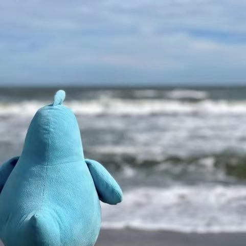

Welcome to my website! I'm Kirk, an 18-year-old student from Shanghai, currently focusing on British A-Levels in Mathematics and Computer Science. While I could be described in various ways—such as an aspiring developer, a math enthusiast who dislikes math problems, or an investor still finding his footing—the label I value most is 'traveler.' Life is a journey with no predetermined end, and my philosophy is to embrace the experience fully, trying new things, forming new relationships, and collecting unforgettable stories. And this is the reason of building this website, to try, to share and to memorize.

The site is built on Forty, an open-source Jekyll theme, and hosted on GitHub. I've customized the theme to meet my own requirements. If you encounter any issues or have feedback while browsing, please feel free to contact me.

